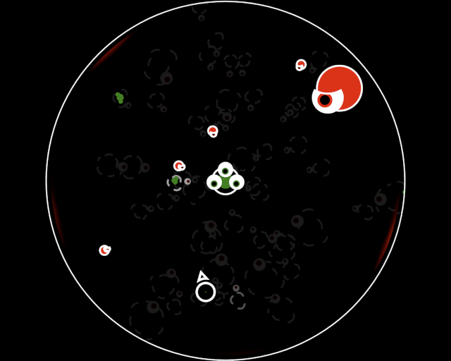

Protect 3-Eyes from the One-Eyed Menace while also keeping it well-fed.

This game is fully implemented using html5 + javascript. Any modern browser should be able to run it, but I only tested in Google Chrome.

[Rate here](https://ldjam.com/users/rialgar/games)

I am pretty happy with this one, I purposefully made all the graphics using the html canvas with no pre-drawn images, but I still achieved a pretty good result. This allowed me to easily modify the graphics to react dynamically to stuff. I used almost the entire second day to add pzazz and really enjoy the results.

## Controls
- Move - WASD/Arrows or Left Stick
- Aim - Mouse or Right Stick
- Shoot - Left Mouse or Right Trigger
- Toggle Sound - M

## Library/Engine
- [Playground.js by rezoner](https://github.com/rezoner/playground) (no longer maintained, docs offline)

## Tools
- [Visual Studio Code by Microsoft](https://code.visualstudio.com/)
- [Google Chrome](https://www.google.com/intl/de_de/chrome/)
- [SFXR by DrPetter](http://www.drpetter.se/project_sfxr.html)